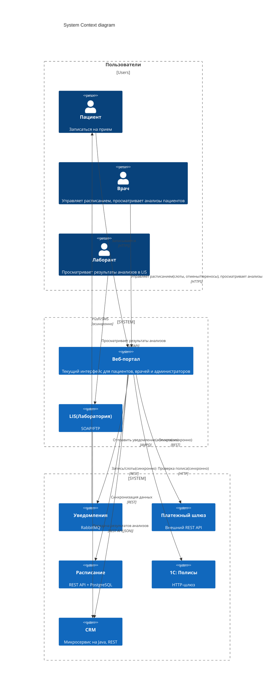

# Сдача проектной работы 5

В этом спринте вы будете работать с кейсом компании «Здоровье+». Это частная сеть многопрофильных клиник с подразделениями в четырёх городах: Москве, Санкт‑Петербурге, Екатеринбурге и Новосибирске. 

## О компании
Бизнес-модель «Здоровья+» сочетает платные услуги (консультации, диагностику и операции) и услуги по ДМС. Ключевые бизнес‑процессы: запись пациентов, лабораторная диагностика, выписка рецептов, оплата, коммуникация (уведомления, результаты исследований и тд.).
Последний год компания активно растёт. У неё открылись пять новых центров, а количество уникальных пациентов увеличилось на 40%. Это вызвало резкий рост нагрузки на ИТ‑системы, которые исторически развивались фрагментарно. Часть систем (расписание и CRM) уже перешла на микросервисы, но остальная архитектура (лабораторная система и учёт полисов на 1С) осталась Legacy.
## Цели бизнеса
Руководство «Здоровья+» решило запустить мобильное приложение для пациентов, которое должно поддержать сценарии:
Запись к врачу онлайн;
Получение результатов анализов без звонка в клинику;
Оплата услуг;
Управление полисами ДМС;
Пуш‑уведомления о статусе записи, готовности анализов и акциях.
### Через три месяца
Промежуточное решение (MVP) должно запустить приложение с базовыми функциями (запись, оплата, уведомления), на 30% снизить нагрузку на колл‑центр за счёт самозаписи и обеспечить стабильную работу при пиковой нагрузке в 500 одновременных пользователей вечерами и в выходные. 
### Финальное решение (через год) 
Подразумевает, что доля онлайн-записи достигнет 70% от общего числа визитов, средний чек вырастет благодаря дополнительным услугам, предлагаемым в приложении, в часы пик оно будет способно выдерживать до 50 тысяч пользователей, а время отклика составит меньше одной секунды для 99% запросов, доступность 99,95% и горизонтальное масштабирование всех компонентов.
## Текущий ИТ-ландшафт
Существующие ИТ-системы и потоки данных представлены на диаграмме контекста С4 (Level 1): 

## Технологический стек и функции систем

| ИТ-система | Функции	| Технологии |
|-|--------|---|
|Расписание|	Управление слотами врачей, запись пациентов, подтверждение и отмена записей	|Java, REST, PostgreSQL
|CRM|	Ведение карточек пациентов, контактной информации, истории обращений. Содержит результаты анализов (из LIS)	|Java, REST, PostgreSQL
|LIS (лабораторная)|	Хранение результатов анализов, автоматический приём данных с оборудования, передача результатов в CRM через REST API. Доступна лаборантам только для просмотра	|SOAP, FTP для загрузки данных с оборудования, REST API для интеграции и передачи данных
|1С: Полисы|	Проверка валидности полиса ДМС, прикрепление полиса к пациенту	|1С:Предприятие, HTTP-шлюз
|Платёжный шлюз|	Проведение онлайн-платежей (внешний поставщик)	|REST API (синхронный)
|Уведомления|	Отправка электронных писем, смс и пушей	|RabbitMQ и внешние провайдеры электронной почты, смс и пушей

Для понимания текущего состояния системы из различных источников собрали информацию.

## Выгрузка из bug-трекинга (Jira)
| Jira ID	| Тип	| Приоритет	| Компонент|	Краткое описание |
|-|--------|---|--|--|
|INT-001|	Bug|	Blocker|	Платёжный шлюз|	При таймауте деньги списываются, статус платежа не фиксируется|
|INT-002|	Bug	|Major|	LIS	|Автоматическая загрузка через FTP падает с 425, требуется ручное восстановление. Задержка передачи в CRM до двух часов|
|INT-003|	Bug	|Critical|	1С	|Проверка полиса падает с 503 на пиках ( >50 rps)|
|INT-004	|Task|	Minor	|Уведомления|	Документировать лимиты RabbitMQ|
|INT-005|	Bug	|Blocker	|Расписание	|Отсутствие идемпотентности — дубли записей при повторных POST|
|INT-006	|Bug|	Major|	Веб-портал	|SQL-инъекция в поле поиска пациента|
|INT-007|	Bug|	Critical|	Интеграция (общее)|	Отсутствие distributed tracing – сложно найти корень сбоя|
|INT-008	|Bug|	Major	|LIS	|Дублирование XML-файлов (сбой при передаче). В CRM попадают дубли анализов|
|INT-009	|Task	|Major	|Расписание|	Репликация базы данных для чтения (блокировки)|
|INT-010|	Epic	|Critical|	Мобильное приложение|	Разработать API Gateway с rate limiting и идемпотентностью при внедрении|
|INT-011	|Bug	|Major|	CRM|	Неактуальные анализы (LIS передал, а CRM не обновила — застряло в очереди)|

## Тикеты в службе поддержки (Service Desk)
|ID	|Дата|	Тема|	Описание	|Статус|
|-|--------|---|--|--|
|SD-001|	10.02|	Зависает проверка полиса	|Администраторы жалуются, что 1С иногда отвечает дольше 30 секунд, а помогает только перезагрузка службы	|Resolved|
|SD-002	|15.02	|Не приходит подтверждение записи|	Пациент оплатил, подтверждение не пришло. В логах ошибка «Booking not found для paymentID»	|Open|
|SD-003|	20.02|	Дубль записи на один слот	|Пациент дважды нажал «Записаться», и образовалось две записи	|Closed|
|SD-004	|25.02	|Зависание при оплате|	При оплате мобильное приложение (тестовая версия) виснет на десять секунд, после чего выдаёт ошибку	|Resolved|
|SD-005	|01.03|	Утром не видны анализы в CRM, загруженные ночью	|Оказалось, что FTP-скрипт падал из-за таймаута, REST-коннектор не переотправил — пришлось запускать вручную |	Closed|
|SD-006	|10.03	|Не приходит пуш-уведомление на андроид	|Очередь RabbitMQ была переполнена из-за пиковой нагрузки |	Resolved|
|SD-007	|20.03|	Врач видит чужого пациента	|Возможно, подмена сессии (security issue) |	In Progress|
|SD-008	|30.03	|При попытке записи появляется «Полис недействителен», хотя нормальный	|1С вернул null, через пять минут повтор – успех	|Closed|
|SD-009|	05.04|	Двойное списание денег	|Дважды списали деньги при оплате|	In Progress|

## Что нужно сделать
Проектная работа состоит из четырёх заданий. Вам предстоит спроектировать целевую интеграционную архитектуру для внедрения мобильного приложения для «Здоровье+». Архитектура должна учитывать разнородность ИТ-систем, обеспечивать отказоустойчивость, масштабируемость и безопасность. 

В результате должен получиться пакет документов по каждому из заданий, который поможет достичь целевого состояния мобильного приложения «Здоровья+».

Проект этого спринта вы будете сдавать в Git-репозитории. Создайте публичный репозиторий в GitHub и назовите его Solution-Health.  

Решение каждого задания нужно будет залить в отдельную директорию. Создайте в репозитории восемь директорий: «Task1», «Task2», «Task3.1», «Task3.2», «Task3.3», «Task4.1», «Task4.2» и «Task4.3».

Чтобы ревьюеру было проще проверять вашу работу, а вам отслеживать изменения на разных итерациях, загрузите файлы в свой репозиторий и сделайте пул-реквест. На ревью нужно отправить ссылку на пул-реквест.

## Как сдать работу
В директории Task1 должна лежать Таблица со списком выявленных проблем.   

В директории Task2 — контекстная диаграмма C4.

В директории Task3.1 — текстовое описание реализации доставки результатов анализов в приложение и выбранное решение, которое будет учитывать гарантированную доставку, поддерживать пиковую нагрузку и простоту эксплуатации, таблицу сравнения и блок-схему потока данных.

В директории Task3.2 — текстовое описание решения с обоснованием выбора типа SAGA, таблица с определением компенсирующих транзакций, диаграмма последовательности для успешного сценария и текстовое описание механизма обеспечения идемпотентности.

В директории Task3.3 — спецификация в формате YAML (фрагмент OpenAPI 3.0) и краткий комментарий с объяснением выбранного подхода к пагинации и версионированию API.

В директории Task4.1 — таблица с параметрами для 1С и платёжного шлюза, обоснование выбора ИТ-системы для приоритетного внедрения Circuit Breaker и описание архитектурного решения для снижения нагрузки на 1С с диаграммой С4 Level 1.

В директории Task4.2 — таблица с реализацией горизонтального масштабирования и указанием по одному ключевому ограничению выбранного метода и одному возможному решению, связанного с этим ограничением.

В директории Task4.3 — описание схемы аутентификации пользователей мобильного приложения и сама схема, таблица политики Rate Limiting и список мер защиты каналов передачи данных.

Перед отправкой решения проверьте, что вы включили в пул-реквест все нужные файлы. Если всё готово, то отправьте ссылку на пул-реквест во вкладке «Ревью».

Не забудьте убедиться, что репозиторий публичный. Если создадите приватный, ревьюер не сможет прокомментировать ваше решение и вернёт его на доработку.

После того как отправите ссылку, не вносите изменения в проект. Дождитесь комментариев ревьюера.
