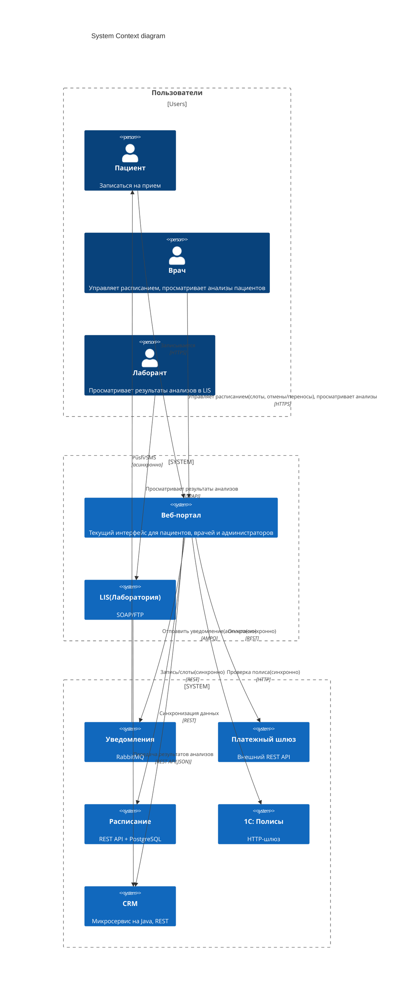

# Сдача проектной работы 5

В этом спринте вы будете работать с кейсом компании «Здоровье+». Это частная сеть многопрофильных клиник с подразделениями в четырёх городах: Москве, Санкт‑Петербурге, Екатеринбурге и Новосибирске. 

## О компании
Бизнес-модель «Здоровья+» сочетает платные услуги (консультации, диагностику и операции) и услуги по ДМС. Ключевые бизнес‑процессы: запись пациентов, лабораторная диагностика, выписка рецептов, оплата, коммуникация (уведомления, результаты исследований и тд.).
Последний год компания активно растёт. У неё открылись пять новых центров, а количество уникальных пациентов увеличилось на 40%. Это вызвало резкий рост нагрузки на ИТ‑системы, которые исторически развивались фрагментарно. Часть систем (расписание и CRM) уже перешла на микросервисы, но остальная архитектура (лабораторная система и учёт полисов на 1С) осталась Legacy.
## Цели бизнеса
Руководство «Здоровья+» решило запустить мобильное приложение для пациентов, которое должно поддержать сценарии:
Запись к врачу онлайн;
Получение результатов анализов без звонка в клинику;
Оплата услуг;
Управление полисами ДМС;
Пуш‑уведомления о статусе записи, готовности анализов и акциях.
### Через три месяца
Промежуточное решение (MVP) должно запустить приложение с базовыми функциями (запись, оплата, уведомления), на 30% снизить нагрузку на колл‑центр за счёт самозаписи и обеспечить стабильную работу при пиковой нагрузке в 500 одновременных пользователей вечерами и в выходные. 
### Финальное решение (через год) 
Подразумевает, что доля онлайн-записи достигнет 70% от общего числа визитов, средний чек вырастет благодаря дополнительным услугам, предлагаемым в приложении, в часы пик оно будет способно выдерживать до 50 тысяч пользователей, а время отклика составит меньше одной секунды для 99% запросов, доступность 99,95% и горизонтальное масштабирование всех компонентов.
## Текущий ИТ-ландшафт
Существующие ИТ-системы и потоки данных представлены на диаграмме контекста С4 (Level 1): 

## Технологический стек и функции систем

| ИТ-система | Функции	| Технологии |
|-|--------|---|
|Расписание|	Управление слотами врачей, запись пациентов, подтверждение и отмена записей	|Java, REST, PostgreSQL
|CRM|	Ведение карточек пациентов, контактной информации, истории обращений. Содержит результаты анализов (из LIS)	|Java, REST, PostgreSQL
|LIS (лабораторная)|	Хранение результатов анализов, автоматический приём данных с оборудования, передача результатов в CRM через REST API. Доступна лаборантам только для просмотра	|SOAP, FTP для загрузки данных с оборудования, REST API для интеграции и передачи данных
|1С: Полисы|	Проверка валидности полиса ДМС, прикрепление полиса к пациенту	|1С:Предприятие, HTTP-шлюз
|Платёжный шлюз|	Проведение онлайн-платежей (внешний поставщик)	|REST API (синхронный)
|Уведомления|	Отправка электронных писем, смс и пушей	|RabbitMQ и внешние провайдеры электронной почты, смс и пушей

## Отзывы сотрудников
Для понимания текущего состояния системы из различных источников собрали информацию.
| Имя | Должность| Отзыв |
|-----|----------|-------|
|Анна|Product Owner| «Мы уже третий месяц пытаемся запустить хотя бы MVP мобильного приложения, но дальше тестовых стендов дело не доходит. Сейчас главная боль пациенты не видят анализы онлайн. Результаты доступны сотрудникам клиники в CRM. но это не помогает пациенту. Человеку приходится звонить, и мы отправляем результат на электронную почту, если он дозвонится. При этом лаборатория может задерживать передачу данных в CRM на несколько часов. Автоматическая загрузка с оборудования иногда сбоит, тогда врач не видит анализы. Всё непредсказуемо. Отдельная история с полисами. Часто онлайн проверка не находит полис, катя через пять минут всё работает нормально. Техподдержка утверждает. что это лагает 1С, а бизнес теряет клиентов».|
|Олег|Руководитель контакт-центра|«Нам обещали, что с приложением звонков станет меньше. Однако его никак не запустят, а веб-портал не справляется. Пока каждой второй звонок «Я записался онлайн, а меня не приняли». Причина - двойные записи ил и потери подтверждения. Люди платят, а слота нет. При этом деньги возвращаются неделями. У нас растёт число эскалаций. Ещё пациенты спрашивают про результаты анализов. Мы не можем дать доступ к CRM, поэтому приходится пересылать скриншоты, что очень не эффективно. Врачи тоже недовольны, что им неудобно управлять расписанием через веб-портал: медленно и иногда не сохраняются изменения».|
|Марина|Менеджер по развитию|«После запуска акции «Скидка 10% на анализы при онлайн-оплате» начался настоящий кошмар. Платежи падали, деньги списывались по два раза. люди злились. Так что акцию пришлось свернуть. Сейчас мы боимся запускать любые предложения, связанные с оплатой, потому что это прямые убытки и репутационные потери. В итоге потенциальные пациенты уходят к конкурента», у кого уже есть удобные мобильные приложения».|
|Дмитрий|Техлид команды расписания|Наша система расписания современная, микросервисная, но, когда к нам обращается веб-портал, мы не умеем различать повторные запросы. Пациент дважды нажал «Записаться» у нас две записи. Идемпотентности нет. С базой данных тоже бода. В часы пик возникают блокировки на таблице слотов. Масштабирование чтения мы не сделали, потому что не было задачи, а теперь страдаем. Кстати, врачи через портал правят расписание, но из за этих блокировок изменения вносятся с задержкой ил и не фиксируются вовст.|
|Елена|DevOps-инженер|«Наш RabbiuMQ держится буквально на честном слове. Пиковые нагрузки (вечером в понедельник) создает огромные очереди. Однажды мы превысили лимит, очередь упала с ошибкой 404 и пользователи не получили уведомления о записях. А сервис уведомлений висит на этом же RabbitMQ. Плюс автоматическая загрузка результатов из лаборатории через FTЗ отдельная песня. Потеря соединения, тайм ауты, никаких автоматических повторов. Если скрипт упал ночью, утром пациенты без анализов. Да, передача c CRM автоматическая, оне ненадёжна: иногда даннае приходят с задержкой до двух часов. Мы не можем гарантировать своевременность».|
|Алексей|Разработчик интеграций|«С 1С работать невозможно. Контракт меняется без уведомлений. В прошлом месяце вместо JSON стали возвращать XML и всё сломалось. Rate limiting нет, так что при небольшом всплеске запросов 1С просто перестаёт отвечать. Мь сделали временное решение: если ответа нет пять секунд, полис считаем. временно валидным. Однако бизнес на это пока не соглашаеться. Интеграция LIS с CRM работает через REST API. Коннектор написан на старом Perl. никто его не сопровождает - при сбоях перезапускаем вручную. Документации лет. Лаборанты заходят в LIS, только чтобы посмотреть, загрузились ли данные. на менять ничего не могут. Загрузка полностью автоматическая с анализаторов».|

### Новости компании
| Город | Дата| Заголовок | Текст публикации |
|-----|----------|--------|------------------|
|Новосибирск|15 марта|«Онлайн-запись в «Здоровье+» даёт сбой четвёртый раз за месяц»|Пациенты жалуются, что оплаченные записи теряются, а деньги не возвращаются. Клиника объясняет это техническими работами. Однако количество жалоб в соцсетях растет. Пользователи советуют записываться по телефону, потому что так надежнее.|
|Екатеринбург|1 апреля|«Врачи «Здоровье+» перегружены, а система расписания не справляется»|В интервью главврач филиала рассказал, что из-за затруднений электронного расписания врачам приходится вести запись в Excel, а потом вносить информацию вручную. Это занимает до двух часов в день.|
|Москва|20 апреля|«Новая акция «Здоровье+». Здоровье без очередей?»|«Здоровье+» планирует запустить мобильное приложение, которое должно упростить запись и оплату. Однако эксперты сомневаются: компания известна проблемами с интеграцией легаси систем. Тем не менее рекламный бюджет ужу заложен.|

## Выгрузка из bug-трекинга (Jira)
| Jira ID	| Тип	| Приоритет	| Компонент|	Краткое описание |
|-|--------|---|--|--|
|INT-001|	Bug|	Blocker|	Платёжный шлюз|	При таймауте деньги списываются, статус платежа не фиксируется|
|INT-002|	Bug	|Major|	LIS	|Автоматическая загрузка через FTP падает с 425, требуется ручное восстановление. Задержка передачи в CRM до двух часов|
|INT-003|	Bug	|Critical|	1С	|Проверка полиса падает с 503 на пиках ( >50 rps)|
|INT-004	|Task|	Minor	|Уведомления|	Документировать лимиты RabbitMQ|
|INT-005|	Bug	|Blocker	|Расписание	|Отсутствие идемпотентности — дубли записей при повторных POST|
|INT-006	|Bug|	Major|	Веб-портал	|SQL-инъекция в поле поиска пациента|
|INT-007|	Bug|	Critical|	Интеграция (общее)|	Отсутствие distributed tracing – сложно найти корень сбоя|
|INT-008	|Bug|	Major	|LIS	|Дублирование XML-файлов (сбой при передаче). В CRM попадают дубли анализов|
|INT-009	|Task	|Major	|Расписание|	Репликация базы данных для чтения (блокировки)|
|INT-010|	Epic	|Critical|	Мобильное приложение|	Разработать API Gateway с rate limiting и идемпотентностью при внедрении|
|INT-011	|Bug	|Major|	CRM|	Неактуальные анализы (LIS передал, а CRM не обновила — застряло в очереди)|

## Тикеты в службе поддержки (Service Desk)
|ID	|Дата|	Тема|	Описание	|Статус|
|-|--------|---|--|--|
|SD-001|	10.02|	Зависает проверка полиса	|Администраторы жалуются, что 1С иногда отвечает дольше 30 секунд, а помогает только перезагрузка службы	|Resolved|
|SD-002	|15.02	|Не приходит подтверждение записи|	Пациент оплатил, подтверждение не пришло. В логах ошибка «Booking not found для paymentID»	|Open|
|SD-003|	20.02|	Дубль записи на один слот	|Пациент дважды нажал «Записаться», и образовалось две записи	|Closed|
|SD-004	|25.02	|Зависание при оплате|	При оплате мобильное приложение (тестовая версия) виснет на десять секунд, после чего выдаёт ошибку	|Resolved|
|SD-005	|01.03|	Утром не видны анализы в CRM, загруженные ночью	|Оказалось, что FTP-скрипт падал из-за таймаута, REST-коннектор не переотправил — пришлось запускать вручную |	Closed|
|SD-006	|10.03	|Не приходит пуш-уведомление на андроид	|Очередь RabbitMQ была переполнена из-за пиковой нагрузки |	Resolved|
|SD-007	|20.03|	Врач видит чужого пациента	|Возможно, подмена сессии (security issue) |	In Progress|
|SD-008	|30.03	|При попытке записи появляется «Полис недействителен», хотя нормальный	|1С вернул null, через пять минут повтор – успех	|Closed|
|SD-009|	05.04|	Двойное списание денег	|Дважды списали деньги при оплате|	In Progress|

## Что нужно сделать
Проектная работа состоит из четырёх заданий. Вам предстоит спроектировать целевую интеграционную архитектуру для внедрения мобильного приложения для «Здоровье+». Архитектура должна учитывать разнородность ИТ-систем, обеспечивать отказоустойчивость, масштабируемость и безопасность. 

В результате должен получиться пакет документов по каждому из заданий, который поможет достичь целевого состояния мобильного приложения «Здоровья+».

Проект этого спринта вы будете сдавать в Git-репозитории. Создайте публичный репозиторий в GitHub и назовите его Solution-Health.  

Решение каждого задания нужно будет залить в отдельную директорию. Создайте в репозитории восемь директорий: «Task1», «Task2», «Task3.1», «Task3.2», «Task3.3», «Task4.1», «Task4.2» и «Task4.3».

Чтобы ревьюеру было проще проверять вашу работу, а вам отслеживать изменения на разных итерациях, загрузите файлы в свой репозиторий и сделайте пул-реквест. На ревью нужно отправить ссылку на пул-реквест.

## Как сдать работу
В директории Task1 должна лежать Таблица со списком выявленных проблем.   

В директории Task2 — контекстная диаграмма C4.

В директории Task3.1 — текстовое описание реализации доставки результатов анализов в приложение и выбранное решение, которое будет учитывать гарантированную доставку, поддерживать пиковую нагрузку и простоту эксплуатации, таблицу сравнения и блок-схему потока данных.

В директории Task3.2 — текстовое описание решения с обоснованием выбора типа SAGA, таблица с определением компенсирующих транзакций, диаграмма последовательности для успешного сценария и текстовое описание механизма обеспечения идемпотентности.

В директории Task3.3 — спецификация в формате YAML (фрагмент OpenAPI 3.0) и краткий комментарий с объяснением выбранного подхода к пагинации и версионированию API.

В директории Task4.1 — таблица с параметрами для 1С и платёжного шлюза, обоснование выбора ИТ-системы для приоритетного внедрения Circuit Breaker и описание архитектурного решения для снижения нагрузки на 1С с диаграммой С4 Level 1.

В директории Task4.2 — таблица с реализацией горизонтального масштабирования и указанием по одному ключевому ограничению выбранного метода и одному возможному решению, связанного с этим ограничением.

В директории Task4.3 — описание схемы аутентификации пользователей мобильного приложения и сама схема, таблица политики Rate Limiting и список мер защиты каналов передачи данных.

Перед отправкой решения проверьте, что вы включили в пул-реквест все нужные файлы. Если всё готово, то отправьте ссылку на пул-реквест во вкладке «Ревью».

Не забудьте убедиться, что репозиторий публичный. Если создадите приватный, ревьюер не сможет прокомментировать ваше решение и вернёт его на доработку.

После того как отправите ссылку, не вносите изменения в проект. Дождитесь комментариев ревьюера.
