## C4 Context – целевая диаграмма

```mermaid

C4Context
    title Здоровье+ – Целевая контекстная диаграмма (C4 Level 1) с полными связями

    Boundary(UserBoundary, "Пользователи") {
        Person(patient, "Пациент (мобильное приложение)", "Записывается, оплачивает, получает результаты, управляет полисом")
        Person(doctor, "Врач", "Просматривает расписание, результаты анализов, подтверждает/отменяет запись")
        Person(labTech, "Лаборант", "Загружает результаты в LIS, проверяет статус, привязывает к пациенту")
    }

    System_Boundary(ExternalBoundary, "Внешние сервисы") {
        System_Ext(PaymentProvider, "Платёжный провайдер", "REST API, PCI‑DSS")
        System_Ext(PushProvider, "Пуш‑сервис (FCM/APNs)", "HTTPS/REST")
        System_Ext(SMSProvider, "SMS‑шлюз", "HTTPS/REST")
        System_Ext(EmailProvider, "Почтовый сервис", "SMTP/REST")
    }

    System_Boundary(ExistingSystems, "Существующие ИТ‑системы") {
        System(WebPortal, "Веб‑портал", "Spring MVC, HTTPS")
        System(CRM, "CRM", "Java‑микросервисы, REST/JSON, PostgreSQL")
        System(Schedule, "Расписание", "Java‑микросервис, REST, PostgreSQL")
        System(LIS, "LIS (Лаборатория)", "SOAP, FTP + REST (JSON)")
        System(OneC, "1С:Полисы", "1С:Предприятие, HTTP‑шлюз")
        System(NotificationLegacy, "Уведомления (legacy)", "RabbitMQ, SMTP/SMС")
    }

    System_Boundary(NewSystems, "Новые компоненты для мобильного приложения") {
        System(ApiGateway, "API‑Gateway", "Kong/Envoy, Rate‑limiting, JWT‑auth, Idempotency‑key")
        System(MobileBFF, "Mobile BFF (Backend‑for‑Frontend)", "Node.js/Go, GraphQL/REST, кеш Redis")
        System(EventBus, "Event Bus", "Kafka (topic‑based pub/sub, exactly‑once)")
        System(NotificationService, "Сервис уведомлений", "Kafka consumer → PushProvider / SMSProvider / EmailProvider")
        System(ResultCache, "Кеш результатов анализов", "Redis (TTL = 24 h, read‑through)")
    }

   
    Rel(patient, ApiGateway, "Выполняет запросы к API", "HTTPS, JWT")
    Rel(ApiGateway, MobileBFF, "Перенаправление + трансформация", "HTTP/HTTPS")
    Rel(MobileBFF, CRM, "Запрос/мутирование данных пациента, запись", "REST/JSON")
    Rel(MobileBFF, Schedule, "Создание/изменение записи", "REST/JSON")
    Rel(MobileBFF, OneC, "Проверка/привязка полиса ДМС", "REST/JSON")
    Rel(MobileBFF, PaymentProvider, "Инициирование онлайн‑платежа", "REST/HTTPS")
    Rel(MobileBFF, ResultCache, "Чтение результатов (read‑through)", "Redis protocol")
    Rel(MobileBFF, EventBus, "Публикация событий (BookingCreated, PaymentSucceeded, LabResultReady)", "Kafka (exactly‑once)")

   
    Rel(doctor, MobileBFF, "Просмотр/подтверждение записи, доступ к результатам", "HTTPS/JSON (через мобильный клиент)")
    Rel(doctor, WebPortal, "Альтернативный доступ к расписанию и картотеке", "HTTPS")
    Rel(doctor, Schedule, "Просмотр/изменение слотов, подтверждение/отклонение записи", "REST/JSON")
    Rel(doctor, CRM, "Просмотр истории пациента, добавление записей", "REST/JSON")
    Rel(doctor, LIS, "Запрос результатов анализа, подтверждение готовности", "REST/JSON (через MobileBFF)")

   
    Rel(labTech, LIS, "Загрузка результатов, изменение статуса анализа", "SOAP/FTP/REST")
    Rel(labTech, ResultCache, "Запись новых результатов (write‑through)", "Redis protocol")
    Rel(labTech, EventBus, "Публикация события LabResultReady", "Kafka")
    Rel(labTech, CRM, "Привязка анализа к карточке пациента (при необходимости)", "REST/JSON")
    Rel(labTech, MobileBFF, "Просмотр готовых результатов через мобильное приложение", "HTTPS/JSON")

   
    Rel(EventBus, NotificationService, "Подписка на события", "Kafka")
    Rel(NotificationService, PushProvider, "Отправка push‑уведомлений", "HTTPS/REST")
    Rel(NotificationService, SMSProvider, "Отправка SMS‑сообщений", "HTTPS/REST")
    Rel(NotificationService, EmailProvider, "Отправка e‑mail", "SMTP/REST")

    
    Rel(LIS, EventBus, "Публикация LabResultReady", "Kafka (exactly‑once)")
    Rel(LIS, ResultCache, "Write‑through запись новых результатов", "Redis")

   
    Rel(CRM, EventBus, "Публикация PatientUpdated, AnalysisLinked", "Kafka")
    Rel(Schedule, EventBus, "Публикация SlotUpdated, BookingCreated", "Kafka")
    Rel(OneC, EventBus, "Публикация PolicyValidated", "Kafka")

   
    Rel(WebPortal, NotificationLegacy, "Уведомления (email/sms) через RabbitMQ", "RabbitMQ")
    Rel(NotificationLegacy, NotificationService, "Потенциальный переход в Kafka (future)", "RabbitMQ → Kafka bridge")

    
    Rel(ApiGateway, PaymentProvider, "Форвард запросов оплаты", "HTTPS")
    Rel(ApiGateway, PushProvider, "Форвард push‑сообщений (если понадобится)", "HTTPS")
    Rel(ApiGateway, SMSProvider, "Форвард SMS‑запросов", "HTTPS")
    Rel(ApiGateway, EmailProvider, "Форвард e‑mail запросов", "SMTP/HTTPS")

    UpdateLayoutConfig($c4ShapeInRow="4", $c4BoundaryInRow="1")
```

---

## Таблица интеграционных паттернов и архитектурных стилей  

| № | Интеграция (источник → получатель) | Паттерн | Почему выбран | Архитектурный стиль / Технология | Комментарий о комбинации (если есть) |
|---|-----------------------------------|--------|----------------|----------------------------------|---------------------------------------|
| 1 | **Mobile‑App → API‑Gateway** | **API‑Gateway + Edge‑Service** | Единственная точка входа, упрощает управление безопасностью, throttling и версионированием. | *Layered Architecture* (презентный слой → gateway) + *Proxy* pattern. | Gateway реализует **rate‑limiting** (Kong/Envoy), **JWT‑auth**, **Idempotency‑Key**. |
| 2 | **API‑Gateway → Mobile‑BFF** | **Backend‑for‑Frontend (BFF)** | Мобильное приложение требует агрегированных данных (расписание + анализы + статус платежа) → один запрос → один ответ. | *Micro‑frontend*‑подход, *Facade* pattern. | BFF использует **Cache‑Aside** (Redis) и **Circuit‑Breaker** при вызове внешних сервисов. |
| 3 | **Mobile‑BFF → CRM** | **Synchronous REST (request‑reply)** | Операции над карточкой пациента, запись, отмена – требуют атомарного подтверждения. | *Client‑Server* style, **HTTP/2** + **JSON**. | Идемпотентность контролируется **Idempotency‑Key** (передаётся в заголовке). |
| 4 | **Mobile‑BFF → Schedule** | **Synchronous REST (request‑reply)** + **Idempotent POST** | Запись/отмена слота – критическая бизнес‑операция, нужна «единожды» гарантия. | *Transactional Service* style, **Optimistic Locking** в PostgreSQL. |
| 5 | **Mobile‑BFF → 1С (Policy Service)** | **Synchronous REST** + **Circuit‑Breaker** | Проверка полиса в реальном времени; 1С часто недоступна → защита от каскадных отказов. | *Resilience* style (Hystrix/Resilience4j). |
| 6 | **Mobile‑BFF → Платёжный шлюз** | **Synchronous REST (callback‑oriented)** + **Compensating Transaction** | Платёж – внешняя система, нужна подтверждённая транзакция; в случае отказа – возврат. | *Saga* (choreography) – событие **PaymentFailed** будет опубликовано в EventBus. |
| 7 | **Mobile‑BFF → ResultCache (Redis)** | **Cache‑Aside / Read‑Through** | Быстрый доступ к результатам анализов (минимум 100 мс). | *Caching* pattern, TTL = 24 h. |
| 8 | **LIS → EventBus (Kafka)** | **Event‑Driven (Publish‑Subscribe)** | Передача результатов анализа в реальном времени, гарантированная доставка (exactly‑once). | *Event Sourcing*‑подход, **Kafka**. |
| 9 | **LIS → ResultCache** | **Write‑Through Cache** | При загрузке новых результатов сразу обновляем кеш, чтобы мобильное приложение получало актуальные данные. |
| 10 | **CRM → EventBus** | **Event‑Driven (Publish‑Subscribe)** | Уведомления о привязке анализа к пациенту, изменении статуса. |
| 11 | **Schedule → EventBus** | **Event‑Driven** | События **BookingCreated**, **SlotUpdated** → уведомления, аналитика, синхронизация. |
| 12 | **EventBus → NotificationService** | **Consumer‑Driven** | Отделяем логику уведомлений от бизнес‑логики, позволяем масштабировать независимо. |
| 13 | **NotificationService → PushProvider / SMSProvider / EmailProvider** | **Outbound Integration (Gateway/Adapter)** | Внешние поставщики используют разные протоколы – адаптер переводит Kafka‑сообщения в HTTP/SMS/SMTP. |
| 14 | **Web‑Portal → Legacy Notification (RabbitMQ)** | **Asynchronous Message Queue** (оставлен для совместимости) | Переходный период – веб‑портал пока публикует в RabbitMQ, позже миграция в Kafka. |
| 15 | **External Systems (PaymentProvider, PushProvider, SMSProvider, EmailProvider) → API‑Gateway** | **Outbound Proxy** | Все внешние вызовы идут через gateway → централизованный мониторинг и политики безопасности. |

### Краткие пояснения к ключевым паттернам

| Паттерн | Краткое описание | Преимущества в контексте «Здоровье+» |
|--------|------------------|---------------------------------------|
| **API‑Gateway** | Точка входа, объединяющая аутентификацию, авторизацию, throttling, роутинг и трансформацию запросов. | Уменьшает количество публичных эндпоинтов, упрощает управление SLA и защищает внутренние сервисы от DDOS и некорректных запросов. |
| **BFF (Backend‑for‑Frontend)** | Специализированный слой, адаптирующий несколько микросервисов под требования мобильного UI (агрегация, формат, кэш). | Сокращает количество round‑trip‑ов, повышает производительность (≤ 1 сек отклика). |
| **Event‑Driven (Kafka)** | Публикация событий в распределённый журнал, потребители подписываются асинхронно. | Обеспечивает **eventual consistency**, легкую масштабируемость, exactly‑once доставку и возможность добавлять новые потребители (например, аналитика) без изменения существующего кода. |
| **Circuit‑Breaker** | Переключает вызовы в fallback‑режим при превышении порога ошибок. | Защищает систему от «домино‑эффекта» при падении 1С или платёжного шлюза; автоматическое восстановление после восстановления провайдера. |
| **Idempotency‑Key** | Уникальный идентификатор запроса, позволяющий серверу признать повторный запрос как уже обработанный. | Предотвращает двойные записи и двойные списания, решает проблему INT‑005. |
| **Saga (Choreography)** | Локальные транзакции, координируемые через события, без централизованного координатора. | Позволяет компенсировать неуспешный платёж (возврат) и откатить запись, не блокируя базу данных. |
| **Cache‑Aside / Write‑Through** | Чтение из кеша, запись сразу в кеш и основной источник. | Обеспечивает быстрый отклик для результатов лаборатории, уменьшает нагрузку на LIS/CRM. |
| **Adapter (Outbound Integration)** | Преобразует внутреннее событие в формат, требуемый сторонним сервисам. | Унифицирует работу с разнородными провайдерами (FCM, Twilio, SendGrid). |
