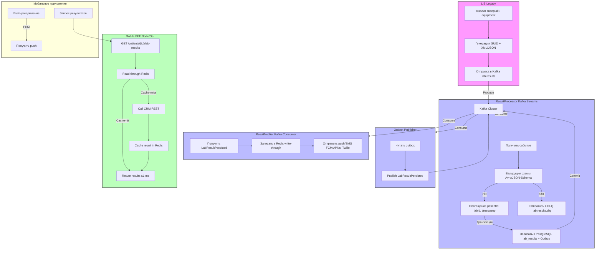

### Текстовое описание решения  

#### 1.1 Краткое описание бизнес‑требований  

| Требование | Приоритет | Краткое объяснение |
|------------|-----------|--------------------|
| **Гарантированная доставка** | 1 | Каждый результат, полученный в LIS, **должен** появиться в мобильном приложении пациента **не более 5 сек** после того, как лаборатория завершила обработку. |
| **Минимальная задержка** | 1 | Пиковые нагрузки – 500 одновременных пользователей (MVP) и впоследствии 50 000 одновременных (final).  latency ≤ 1 сек для 99 % запросов. |
| **Отказоустойчивость** | 1 | Потеря сообщения недопустима; система должна автоматически восстанавливать любимый процесс без ручного вмешательства. |
| **Простота эксплуатации** | 2 | Операторы лаборатории (labTech) должны иметь **один‑клик** возможность «перезапустить загрузку», а DevOps – однорядные автоматические скрипты для мониторинга и восстановления. |
| **Трассировка и аудит** | 2 | Необходимо видеть, в каком статусе находится каждое исследование («принято», «отправлено», «доставлено», «отклонено»). |
| **Масштабируемость** | 2 | Возможность горизонтального масштабирования без изменения бизнес‑логики. |
| **Идемпотентность** | 1 | Дублирование сообщений (из‑за повторных попыток) не должно приводить к дублированию записей в CRM/моб‑клиенте. |

#### 1.2 Ключевые ограничения существующей среды  

* **LIS** – legacy‑система. Доступен **SOAP** и **FTP** (для автоматической выгрузки файлов с оборудованием). Пул‑скрипт, который читает FTP, часто падает (INT‑002).  
* **CRM** – микросервисный, но использует **REST/JSON** без idempotency и без встроенного event‑bus.  
* **Уведомления** – RabbitMQ, но без лимитов, часто переполняется (SD‑006).  
* **Отсутствие распределённого трейса** (INT‑007) → сложно отследить, где «застрял» результат.  
* **Лаборанты** не могут «передавать» результат вручную – они только просматривают.  

#### 1.3 Выбранный архитектурный подход  

| Шаг | Что делаем | Как реализуем | Почему так? |
|-----|------------|----------------|-------------|
| **1. Интеграция LIS → Event Bus** | После завершения анализа LIS публикует **одно событие** `LabResultReady`. | **Kafka** (topic `lab.results`).  *Exactly‑once* семантика, репликация (3 FA). | Гарантирует, что событие будет доставлено хотя бы один раз и **не будет дублироваться** даже при пере‑отправках. |
| **2. Трансформация и валидирование** | Консьюмер (`ResultProcessor`) читает событие, проверяет схему (Avro/JSON‑Schema), обогащает метаданными (patientId, testCode, labId). | **Kafka Streams** (stateless) → **ResultProcessor** (Java / Kotlin). | Позволяет масштабировать горизонтально, проводить валидацию без блокировок БД. |
| **3. Запись в CRM и в кеш** | **Transactional outbox**: в рамках одной транзакции пишем в PostgreSQL (таблица `lab_results`) и в `outbox`‑таблицу. Затем отдельный процесс `OutboxPublisher` публикует `LabResultPersisted` в Kafka. | **Spring Boot** + **Transactional Outbox** (Debezium‑style). | Гарантирует **атомарность** записи и последующей публикации – нет «потери» между DB и шиной. |
| **4. Публикация события о готовости результата** | `LabResultPersisted` → подписывается **MobileBFF** (или отдельный **ResultNotifier**). | **Kafka consumer** → **Redis Cache** (write‑through) + **push‑уведомление**. | Позволяет мгновенно обслуживать запросы мобильных клиентов (чтение из Redis ≈ 1 ms) и отправлять push‑уведомление. |
| **5. Обеспечение идемпотентности** | Каждый `LabResultReady` имеет **globally unique identifier** (GUID) из LIS (уже генерируется на оборудовании). При обработке проверяем наличие GUID в таблице `lab_results`. | **Unique constraint** + **Idempotency‑Key** в заголовке Kafka‑сообщения. | Дублирование из‑за повторной загрузки FTP не создаст дублей в базе. |
| **6. Автоматический retry + DLQ** | При любой обработке (Step 2‑4) ошибки (schema, DB, внешние сервисы) → **exponential back‑off** retry (max 5 раз). После исчерпания – сообщение в **DLQ** (`lab.results.dlq`). | **Kafka consumer config** (`retry.backoff.ms`, `max.poll.records`). | Позволяет без потери данных, а в DLQ – оператор видит «застрявшие» результаты и может вручную пере‑отправить. |
| **7. Мониторинг & Tracing** | Каждый шаг отправляет **OpenTelemetry**‑трассы и метрики (latency, success/failure). | **Jaeger** (distributed tracing) + **Prometheus + Grafana**. | Прозрачность, SLA‑контроль, быстрый поиск корня проблемы. |
| **8. UI‑слой (мобильное приложение)** | Клиент делает запрос `GET /patients/{id}/lab-results` к **MobileBFF**. BFF читает из **Redis** (cache‑aside). При **cache‑miss** – BFF делает **sync call** к CRM (REST). | **Node.js/Go BFF** + **Redis**. | Ожидание < 1 сек, минимум нагрузки на CRM. |
| **9. Уведомления** | После успешного `LabResultPersisted` – `ResultNotifier` (Kafka consumer) формирует событие `NotifyPatientResultReady` → отправка push‑уведомления через **FCM/APNs**, а также SMS (при необходимости). | **Notification Service** (microservice) → **PushProvider** (FCM/APNs) + **SMSProvider**. | Пользователь узнаёт о готовности мгновенно. |
| **10. Оперативный UI для лаборатории** | Веб‑консоль **LabOps** (Spring Boot) показывает статус всех сообщений (queue, DLQ, processed). Кнопка **«Replay»** отправляет сообщение из DLQ обратно в основной topic. | **Kafka‑Web‑UI** (Kowl) + кастомный Dashboard. | Лаборанты могут без помощи DevOps «перезапустить» загрузку. |

### Таблица сравнения возможных архитектур  

| № | Вариант реализации | Технологический стек | Плюсы | Минусы | Оценка «Гарант + Задержка + Эксплуатация» (0‑5) | Почему выбран именно **Kafka‑based Event‑Driven** |
|---|--------------------|----------------------|-------|--------|-----------------------------------------------|---------------------------------------------------|
| 1 | **Прямой REST‑push от LIS в CRM** (как сейчас) | SOAP/FTP → Java‑коннектор → REST → CRM | Простейшая реализация, без дополнительных компонентов | Потери сообщений, дубли, отсутствие retry, отсутствие идемпотентности, высокая задержка (часы) | 1 | Не обеспечивает гарантированную доставку, нет масштабируемости. |
| 2 | **FTP → очередь RabbitMQ → консюмер → CRM** | FTP → RabbitMQ (очередь) → Java‑консьюмер → CRM | Асинхронность, уже есть RabbitMQ | Очередь без лимитов → переполнение (SD‑006), отсутствие exactly‑once, сложный мониторинг, DLQ‑отсутствие, нет распределённой трассировки | 2 | RabbitMQ может обеспечить durability, но без **exactly‑once** и без масштабируемой репликации под нагрузкой. |
| 3 | **Кастомный сервис на базе HTTP‑webhook от LIS → CRM → кеш** | LIS POST → Webhook‑service → CRM + Redis | События сразу в HTTP, прост в реализации | Требует надёжного HTTPS‑endpoint у LIS (не гарантировано), нет retry, при падении веб‑сервиса результаты теряются | 2 | LIS в текущем виде не умеет **push** по HTTPS, работает только pull/FTP. |
| 4 | **Кофра (Kafka) + Outbox + Redis** *(рекомендованное)* | LIS → **Kafka** (topic `lab.results`) → **Kafka Streams** → **Transactional Outbox** → **CRM** + **Redis** → **Notification Service** | Exactly‑once, горизонтальное масштабирование, встроенные retry/DLQ, возможность replay, трассировка, idempotency, low latency (< 5 сек), простой мониторинг (Prometheus). | Требует внедрение Kafka‑кластера (оперативный overhead), начальная настройка. | **5** | Наилучшее сочетание **надёжности**, **малом задержки**, **масштабируемости** и **операционной простоты** (авто‑retry, DLQ, UI‑replay). |

> **Итог:** Выбираем вариант **4** – *Event‑Driven Architecture на базе Apache Kafka* c transactional outbox и кеш‑слоем Redis.  

---

### Блок‑схема потока данных (LIS → мобильное приложение)

**Ключевые точки контроля (trace points):**  

| Точка | Что измеряем | Где логируем |
|-------|--------------|--------------|
| `LabResultReady` (LIS → Kafka) | timestamp, GUID, equipment‑id | Kafka **Headers**, Jaeger span `lis.produce` |
| `ResultProcessor` | schema‑validation‑status, DB‑write‑latency | Jaeger span `processor.validate`, Prometheus metric `processor_success_total` |
| `OutboxPublisher` | outbox‑publish‑latency | Jaeger span `outbox.publish` |
| `ResultNotifier` | push‑sent‑status, SMS‑status | Jaeger span `notifier.push`, metric `push_success_total` |
| `MobileBFF` | cache‑hit‑ratio, response‑time | Prometheus metric `bff_response_seconds`, Jaeger `bff.request` |
| `DLQ` | количество «застрявших» сообщений | Grafana panel `kafka_dlq_size` |

---

### Как будет выглядеть эксплуатация  

| Операция | Кто выполняет | Инструмент | Что делается |
|----------|---------------|------------|--------------|
| **Мониторинг задержки от готовности анализа до push‑уведомления** | DevOps/Ops‑Team | Grafana + Prometheus | Алерт `lab_result_delivery_latency > 5s` → тикет в ServiceDesk. |
| **Перезапуск упавшего FTP‑скрипта** | LabOps | `systemd`‑служба + **Kowl** (Kafka‑UI) | Если в DLQ появились сообщения `lab.results.dlq`, оператор нажимает **Replay** → сообщение отправляется обратно в `lab.results`. |
| **Отладка «потерянного» результата** | Support | Jaeger UI | По GUID ищем все спаны: `lis.produce → processor.validate → outbox.publish → notifier.push`. |
| **Периодическое обновление схемы** | Data‑Team | Confluent Schema Registry | Обновляют Avro‑schema v2, консьюмеры автоматически фиксируют совместимость. |
| **Масштабирование** | Platform Engineer | Kubernetes HPA + Kafka‑KRaft/Confluent | При росте нагрузки (CPU > 70 % на `ResultProcessor`) автоматически добавляются реплики. |
| **Бэкап** | DB‑Admin | PostgreSQL pg_dump + Kafka mirroring (MirrorMaker2) | Снимок `lab_results` + реплика Kafka в отдельный дата‑центр. | 
