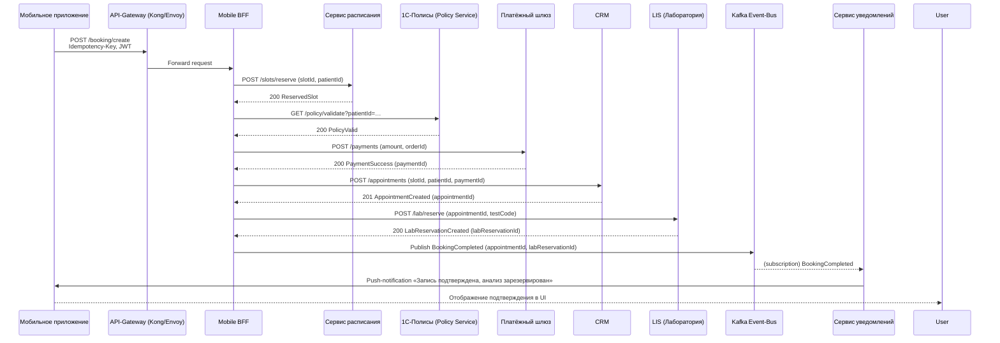

### Диаграмма последовательности (UML Sequence) – успешный сценарий  

**Ключевые детали:**

| Шаг | Что делаем | Транспорт | Почему асинхронно |
|-----|------------|-----------|-------------------|
| 1‑4 | Резервируем слот, проверяем полис, проводим платёж | **Синхронные REST‑запросы** через BFF → гарантируем, что каждый из этих действий завершился успешно, прежде чем переходить к следующему. | Нужно знать, что слот действительно свободен, полис действителен и деньги получены. |
| 5‑6 | Создаём запись в CRM и резервируем анализ в LIS | **Синхронный REST** (для атомарности записи) | CRM и LIS должны согласовать *appointmentId* → *labReservationId*. |
| 7‑9 | Публикуем событие **BookingCompleted** в Kafka, сервис уведомлений доставляет push‑сообщение | **Асинхронный pub/sub** | Нотификация не должна блокировать транзакцию оплаты/записи; гарантируем **exactly‑once** доставку через Kafka. |

---

### Выбор типа SAGA  

**Тип SAGA:** **Choreography‑based SAGA** (без центрального координатора).  

1. **Низкая связность** – каждый микросервис (Schedule, PolicySrv, PayGate, CRM, LIS) уже реализован как независимый REST‑сервис; добавление отдельного оркестратора усложнило бы их взаимодействие и сталo бы точкой отказа.  
2. **Гарантированная доставка событий** – Kafka обеспечивает *exactly‑once* семантику и возможность **replay**, что позволяет отдельным сервисам реагировать на событие *BookingCompleted* без необходимости синхронных обратных вызовов.  
3. **Масштабируемость** – каждый сервис может масштабироваться независимо, а компенсационные действия (отказ) инициируются самим сервисом, получившим событие *BookingFailed* (или *Timeout*).  
4. **Простота отката** – при ошибке в любой из синхронных шагов BFF сразу возвращает клиенту отказ, а уже завершённые операции (резервирование слота, удержание средств) компенсируются локальными **compensating‑transactions**, опубликованными в Kafka (например, `SlotRelease`, `PaymentRevert`).  

---

### Таблица компенсирующих транзакций  

| Шаг сценария (основной)                              | Компенсирующее действие (Compensation)                                                            | Какой риск устраняется |
|------------------------------------------------------|---------------------------------------------------------------------------------------------------|------------------------|
| **1. Резервирование слота в Schedule** (`POST /slots/reserve`) | `SlotRelease(slotId, reservationId)` – отмена брони, возврат слота в состояние *available* (REST DELETE). | **Дублирование/захват слота** – если дальше произойдёт ошибка, слот не останется «заблокированным». |
| **2. Платёж в PayGate** (`POST /payments`)           | `PaymentRevert(paymentId, amount)` – возврат удержанных средств через API шлюза (REST POST /refund). | **Двойное списание/зависание средств** – если запись не создаётся, деньги возвращаются клиенту. |
| **3. Резервирование анализа в LIS** (`POST /lab/reserve`) | `LabReservationCancel(labReservationId)` – отмена зарезервированного времени/оборудования (REST DELETE). | **Неоправданная блокировка лабораторных ресурсов** – освобождает слот в LIS, если запись в CRM не прошла. |

> **Сценарий отката**: при любой ошибке BFF публикует событие `BookingFailed` в Kafka, где каждый из микросервисов, который уже совершил действие, слушает его и исполняет свой компенсирующий запрос (см. таблицу). После завершения всех компенсаций BFF возвращает клиенту ошибку с объяснением.

---

### Механизм обеспечения идемпотентности на входе  

| Где нужен Idempotency | Техническая реализация |
|-----------------------|------------------------|
| **POST /booking/create** (вход в BFF) | **Idempotency‑Key** (UUID) передаётся в заголовке `Idempotency-Key`. При получении BFF проверяет в Redis (TTL = 24 h) наличие уже обработанного ключа. Если найден – сразу возвращает ранее сохранённый ответ (HTTP 200/201) без повторного выполнения бизнес‑логики. |
| **POST /slots/reserve** (Schedule) | **Unique constraint** в таблице `slot_reservations` по полю `reservation_id`. `reservation_id` генерируется в BFF (тот же Idempotency‑Key) и передаётся сервису. При дублировании БД вернёт `Conflict`, BFF преобразует в «повторный запрос – уже обработан». |
| **POST /payments** (PayGate) | **Idempotency‑Key** передаётся в заголовке к шлюзу (многие провайдеры поддерживают). Шлюз сохраняет статус операции и при повторном запросе возвращает тот же `paymentId`. |
| **POST /appointments** (CRM) | В CRM сохраняется `external_booking_id` (тот же UUID). Уникальный индекс обеспечивает, что повторная запись с тем же ID не создаст дубликат. |
| **POST /lab/reserve** (LIS) | LIS закрепляет `labReservationId`, генерируемый BFF, и хранит уникальный индекс. |

**Дополнительные меры**

* **Транзакционный outbox** в микросервисах (Schedule, CRM) – запись в локальную `outbox`‑таблицу вместе с основным бизнес‑операцией гарантирует, что событие о завершении будет опубликовано **только один раз**.  
* **Distributed Tracing** (OpenTelemetry) – каждое сообщение несёт `trace‑id` = Idempotency‑Key, что упрощает диагностику повторных запросов.  
