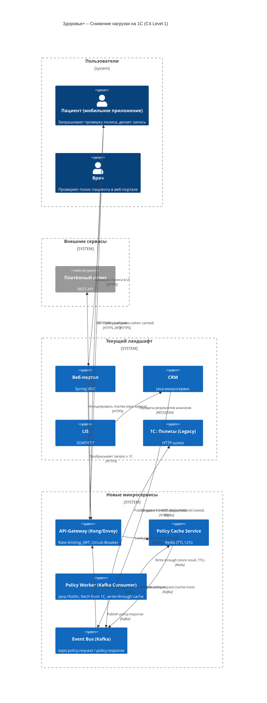

## Таблица параметров отказоустойчивости  

| **Система** | **Таймаут (сек.)** | **Стратегия повторных попыток** | **Количество попыток** | **Интервал между попытками** | **Фолбек‑действие** | **Обоснование** |
|-------------|-------------------|--------------------------------|------------------------|-----------------------------|----------------------|-----------------|
| **1С : Полисы** | **4 сек** (⩽ 30 сек ‑ слишком долго, > 4 сек ‑ быстро определяем, что сервис перегружен) | **Экспоненциальный back‑off** + jitter (to avoid thundering herd) | **3** (первый запрос + 2 повтора) | 1 сек → 2 сек → 4 сек (с ± 200 мс jitter) | **Graceful‑degrade** – возвращаем клиенту «Полис временно недоступен, попробуйте позже». При этом сохраняем запрос в отдельный **Retry‑Queue** (Kafka topic `policy.retry`) → платформа периодически пере‑отправляет. | 1С начинает отказывать уже при > 50 RPS, а задержки > 30 сек. Ограниченный timeout + несколько быстрых ретраев позволяют быстро отсеять «залипающие» запросы и не держать поток клиента в ожидании. |
| **Платёжный шлюз** | **2 сек** (короткий, потому‑что платёж‑операции должны быть быстрыми; если шлюз не отвечает – лучше отменить операцию) | **Фиксированный интервал** (без экспоненты) | **2** (первый запрос + один повтор) | **1 сек** (пауза между попытками) | **Compensating transaction** – если после повторов статус всё‑равно «неизвестен», генерируем событие `PaymentCompensate` в Kafka, которое инициирует возврат средств (refund) и сообщает клиенту о том, что платёж будет возвращён в течение 24 ч. | Платёжный шлюз иногда «теряет» статус и списывает деньги, но не сообщает о результате (INT‑001). После таймаута необходимо гарантировать, что клиент получает **идемпотентный** статус *Pending* и, в случае неудачи, **компенсацию**, чтобы избежать двойного списания (см. тикет INT‑001, SD‑009). |

> **Почему именно такие значения?**  
> * Таймауты выбираются меньше половины максимальной SLA‑окна (30 сек для 1С, 10 сек для платёжного шлюза из тикетов) –‑ таким образом мы быстро фиксируем «залипающие» запросы и можем перейти к fallback‑логике, не блокируя поток.  
> * Экспоненциальный back‑off для 1С снижает ударную нагрузку при всплесках (спросит > 50 RPS → сразу «замедлится»).  
> * Для платёжного шлюза важно выполнить **один** быстрый повтор (иначе риск двойного списания растёт).  

---

## Обоснование приоритетного внедрения **Circuit Breaker**  

### Почему **Circuit Breaker** критичен для 1С  

| Аспект | 1С : Полисы | Платёжный шлюз |
|--------|-------------|----------------|
| **Поведенческий профиль** | На пиках > 50 RPS → ответы 503, зависание > 30 сек. Ошибки часто «короткие», но повторные запросы усиливают нагрузку (эффект «конвейера»). | Платёжный шлюз отвечает быстро, но при тайм‑ауте происходит **неопределённый** статус платежа (возможны двойные списания). Ошибки редки, но критичны. |
| **Последствия отказа** | Потеря проверки полиса → запись отклоняется, пользователь вынужден повторять запрос → рост обращений в кол‑центр (SD‑008). | Потеря списка платежей → двойные списания и юридические проблемы (INT‑001, SD‑009). |
| **Потенциал «cascade failure»** | При открытом Circuit Breaker запросы к 1С перестанут доходить, сервисы‑клиенты (Web‑Portal, Mobile‑BFF) сразу получат быстрый отказ и могут переключиться на fallback‑кеш/очередь. Это **сохраняет стабильность** всей цепочки записи. | Платёжный шлюз вызывается только в момент оплаты; если CB откроется, пользователь получит мгновенный отказ и сможет выбрать альтернативный способ оплаты, но бизнес‑процесс всё‑равно будет прерван. |
| **Требуемая реакция** | Нужно **быстро отключать** запросы к 1С, когда она начинает «залипать», чтобы остальные сервисы (Schedule, CRM) не зависли в ожидании. | Для шлюза достаточно **retry + compensation**; CB может привести к отказу оплаты, но в этом случае пользователь всё равно видит ошибку и переходит к другому методу. |

**Итого:**  
*1С — самый «шумный» и **часто перегружаемый** компонент. Применение Circuit Breaker к ней даст наибольший выигрыш в общей доступности системы, предотвращая лавинообразный рост задержек и позволяя клиентским сервисам быстро возвращать контролируемый отказ.*  

### Механизм работы Circuit Breaker (для 1С)

1. **Closed state** – запросы к 1С пропускаются напрямую. Счётчик ошибок (`failureCount`) = 0.  
2. При каждом **неуспешном** запросе (HTTP ≥ 500, тайм‑аут > 4 сек) `failureCount` инкрементируется.  
3. Если `failureCount` ≥ **threshold = 5** за **window = 10 сек**, CB переходит в **Open state**:  
   * Все входящие запросы сразу получают ответ **503 Service Unavailable** (или кастомный `POLICY_UNAVAILABLE`).  
   * Открытый период (`openTimeout`) = **30 сек**.  
4. По истечении `openTimeout` CB переходит в **Half‑Open** – позволяет **первому** запросу пройти к 1С:  
   * Если запрос **успешен** → CB переходит в **Closed** и `failureCount` сбрасывается.  
   * Если запрос **неудачен** → CB сразу возвращается в **Open** и `openTimeout` удваивается (exponential back‑off) до максимального **5 мин**.  
5. **Fallback** при Open/Half‑Open:  
   * Возврат клиенту `POLICY_UNAVAILABLE, please retry later`.  
   * Публикация сообщения в Kafka‑topic `policy.retry` (со смещением + тайм‑стамп), откуда отдельный **Retry‑Worker** будет периодически пере‑отправлять запрос к 1С (по 1‑разу в 30 сек).  
   * Таким образом система **само‑восстанавливается** без вмешательства человека.  

Это типичная реализация, поддерживаемая библиотеками **Resilience4j** (Java) / **Polly** (C#) и легко интегрируется в **API‑Gateway** (Kong/Envoy с плагином `circuit-breaker`) и в **Microservice**‑уровень (BFF, Schedule).

---

## Архитектурное решение – снижение нагрузки на 1С  
### Краткое описание  

* **Проблема:** 1С отвечает медленно при пиковых запросах (> 50 RPS) и иногда «залипает» > 30 сек, что приводит к отказам проверки полиса.  
* **Цель:** убрать **многократные** прямые запросы к 1С из клиентских потоков и реализовать **кеширование** часто используемых полисов + **асинхронный** запрос‑обновление.  
* **Решение:**  
  1. **API‑Gateway** → **Policy Cache Service** (ин‑мемори кеш Redis) → **Circuit‑Breaker** → **1С**.  
  2. При **cache‑miss** шлюз отправляет запрос в 1С **асинхронно** через **Kafka** (topic `policy.request`).  
  3. **Policy Worker** (микросервис) читает запрос, получает полис из 1С, сохраняет в **Redis** (TTL = 12 ч) и публикует событие `policy.response`.  
  4. Первичный клиент (Mobile BFF / Web‑Portal) получает **первичный ответ** – *“Полис пока проверяется, будет готов через секунду”* (HTTP 202 + `Retry-After`). При следующем запросе (через 1‑2 сек) уже будет информация из кеша.  
  5. При **успешной проверке** клиент получает `200 OK`. При **ошибке** – `503` с фолбек‑сообщением.  

* Плюс: **Bulk‑pre‑warm** – nightly batch‑job (Kafka producer) запрашивает все полисы, активные в текущий день, и заполняет кеш, тем самым сокращая количество запросов в реальном времени.  

### C4 Level 1 (контекст) – диаграмма

**Что изменилось по сравнению с исходным контекстом:**

| Компонент | Зачем он нужен |
|-----------|----------------|
| **Policy Cache Service (Redis)** | Сокращает количество прямых запросов к 1С; часто проверяемые полисы (активные DMS‑клиенты) находятся в памяти. |
| **Policy Worker + Kafka** | Асинхронный запрос к 1С → не блокирует клиентский поток; обеспечивает **retry** и **exactly‑once** доставку. |
| **Circuit‑Breaker в API‑Gateway** | Останавливает поток запросов к 1С при длительных зависаниях, переводя их в fallback‑режим (202 + Retry‑After). |
| **Bulk‑pre‑warm job** (не показан в диаграмме, но упомянут в описании) | Ежедневно «прогревает» кеш всеми полисами, которые будут востребованы в текущий день, тем самым практически устраняя cache‑miss в часы пик. |
