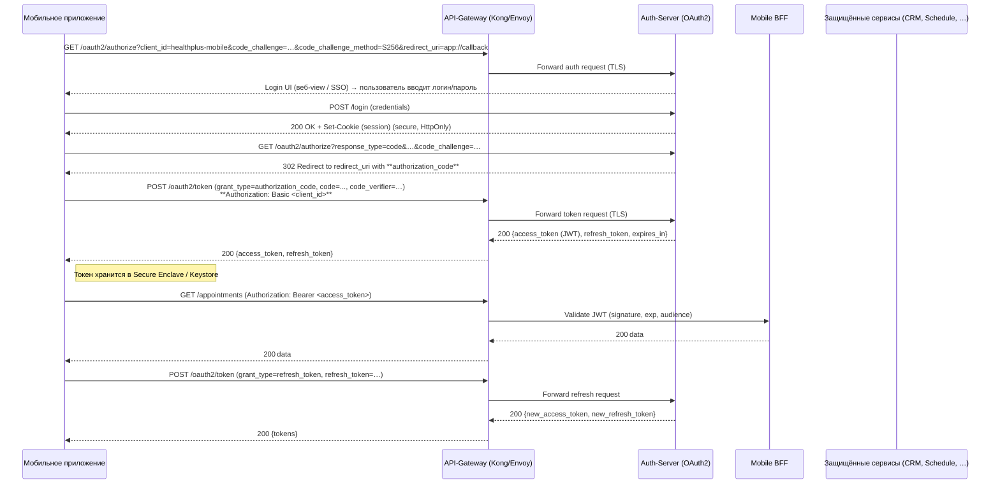

## Схема аутентификации пользователей мобильного приложения  

### Выбранный протокол  

| Требование | Выбранный вариант | Почему |
|------------|-------------------|--------|
| **Мобильный клиент** – не может хранить секреты, не должен использовать `client_secret` | **OAuth 2.0 Authorization Code grant + PKCE** (Proof‑Key for Code Exchange) | PKCE защищает код авторизации от подмены даже без клиентского секрета. Стандарт поддерживается iOS / Android SDK‑ами и легко интегрируется с API‑Gateway‑ом (Kong, Envoy). |
| **Токен** | **JWT (signed HS256 or RS256)**, **access‑token ≈ 5 мин**, **refresh‑token ≈ 30 дн** | JWT‑токен легко валида­ровать без обращения к цент­ральному хранилищу, а короткое время жизни снижает риск компрометации. |
| **Транспорт** | **HTTPS ( TLS 1.2 / 1.3 )**  | Обеспечивает конфиденциальность и целостность данных, а также позволяет использовать **certificate‑pinning** в мобильном клиенте. |

### Описание процесса (схема)  

#### Ключевые пункты, которые отвечают требованиям безопасности  

| Пункт | Что гарантирует |
|------|-----------------|
| **PKCE** (code_challenge / code_verifier) | Защита от захвата `authorization_code` в публичных клиентах. |
| **HTTPS‑only** + **certificate‑pinning** в мобильном клиенте | Защищает от MITM‑атак, даже если атакующий получит поддельный сертификат. |
| **JWT‑access ≤ 5 мин** | Ограничивает «окно» использования украденного токена. |
| **Refresh token http‑only, long‑lived, хранимый в Secure Enclave** | Доступ к обновлению токенов только внутри защищённого хранилища. |
| **Short‑lived session cookie (HttpOnly, SameSite=Strict) в Auth‑Server** | Предотвращает подмену сессии (SQL‑инъекция/Session‑Fixation). |
| **Audience & Scope claim** в JWT | Сервис проверяет, что токен предназначен именно ему (мульти‑тентантная инфраструктура). |

---

## Политики Rate‑Limiting  

| **Тип запроса** | **Лимит** (requests / время) | **Действие при превышении** | **Комментарий** |
|-----------------|-------------------------------|-----------------------------|-----------------|
| **Публичный запрос «Поиск врачей»** (`GET /doctors?query=…`) | **30 req / мин** с **IP‑based** ограничением (burst = 5). | Возврат **429 Too Many Requests** + заголовок `Retry-After: <seconds>`. | Поиск –‑ открытый, но должен защищать от сканирования и DDoS; лимит в 30 мин позволяет выполнить типичный поиск без ощутимых задержек. |
| **Авторизованный запрос «Создание записи к врачу»** (`POST /appointments`) | **5 req / сек** (user‑based) + **burst = 2**. | Возврат **429** + `Retry-After`. При повторных быстрых попытках – автоматический **back‑off** в клиенте (exponential, 1 s → 2 s → 4 s). | Сервис записи уже имеет проблему дублирования (INT‑005). Ограничение в 5 RPS на пользователя гарантирует отсутствие двойных записей и уменьшает нагрузку на Schedule. |
| **Общий лимит на уровне API‑Gateway** | **10 000 req / мин** глобально (все эндпоинты) | При достижении – включить **global throttling** и отправлять **503 Service Unavailable** клиенту до восстановления. | Защищает от всплесков трафика (от DDoS) и сохраняет стабильность остальных микросервисов. |

> **Техническая реализация** – плагин `rate-limiting` в Kong/Envoy, настроенный через **Consumer‑based** (по `sub` из JWT) и **IP‑based** правила. При срабатывании правила генерируется метрика `rate_limit_exceeded` в Prometheus / Grafana, а алерт отправляется в Slack/Telegram.

---

## Обязательные меры защиты каналов передачи данных  

| № | Мера | Описание (как реализуется) | Ожидаемый эффект |
|---|------|----------------------------|------------------|
| **1. TLS 1.2 / 1.3** | Весь трафик между мобильным клиентом, API‑Gateway, микросервисами и внешними провайдерами шифруется TLS. Серверные сертификаты получены от доверенного CA, включены **OCSP stapling** и **HSTS** (max‑age = 315 36000). | Конфиденциальность и целостность данных, защита от MITM. |
| **2. Certificate Pinning** | В клиентском коде (Android / iOS) хранится отпечаток публичного ключа сервера (SHA‑256). При подключении клиент проверяет совпадение. | Защита от компрометации CA и подмены сертификата. |
| **3. Secure Storage of Secrets** | Access‑/Refresh‑токены сохраняются в **Secure Enclave (iOS)** / **Android Keystore**; `HttpOnly`, `Secure` cookies –‑ недоступны JS. | Предотвращение кражи токенов через XSS / malware. |
| **4. Short‑Lived Access Tokens + Refresh Tokens** | Access‑token ≤ 5 мин, refresh‑token ≤ 30 дн, подпись RS256, хранится только в безопасном хранилище. При подозрении (анализ поведения) токен может быть отозван через **revocation list** в Redis. | Ограничивает время действия украденного токена, облегчает отзыв. |
| **5. HTTP‑Only, SameSite=Strict Cookies** | Сессия в Auth‑Server выдаётся в cookie с атрибутами `HttpOnly`, `Secure`, `SameSite=Strict`. | Защита от CSRF и подмены сессии (SD‑007). |
| **6. Input Validation & Parameterised Queries** | Все входные данные (search query, appointment payload) проходят **strict whitelist validation**. В бекэнде используются **prepared statements / ORM** с параметрами, запрещённые символы (`,`, `;`, `'`) экранируются. | Предотвращение SQL‑инъекций (INT‑006). |
| **7. Content‑Security‑Policy (CSP) & X‑Content‑Type‑Options** | В ответах веб‑слоя (Web‑Portal, BFF) добавлен заголовок `Content‑Security‑Policy: default-src 'self' https:` и `X‑Content‑Type‑Options: nosniff`. | Защита от XSS и загрузки нежелательного контента. |
| **8. Audit Logging & Immutable Log Storage** | Все запросы к критическим эндпоинтам (auth, payment, policy check) записываются в **ELK‑stack** с меткой `userId`, `timestamp`, `requestId`. Логи записываются в **immutable S3 bucket** (WORM). | Возможность расследования инцидентов, соответствие GDPR / HIPAA. |
| **9. Encryption‑at‑Rest** | Базы PostgreSQL (CRM, Schedule) зашифрованы **Transparent Data Encryption (TDE)**; Redis‑cache использует **AES‑256‑at‑rest** (via encrypted EBS). | Защита данных в случае компрометации хоста/диска. |
| **10. Regular Key Rotation** | Ключи подписи JWT (RSA) и сертификаты TLS вращаются каждые **90 дней**; автоматизированный процесс через **HashiCorp Vault**. | Снижение риска длительного компрометирования ключей. |
| **11. Security‑Headers Hardening** | Добавлены `X‑Frame‑Options: DENY`, `Referrer-Policy: no‑referrer`, `Feature-Policy: none`. | Снижение риска click‑jacking, information‑leak. |
| **12. Pen‑Test & Vulnerability Scanning** | По расписанию (ежемесячно) запускается **OWASP ZAP** и **Snyk** для обнаружения уязвимостей в API, а также **static code analysis** для мобильных APK/IPA. | Проактивное обнаружение новых уязвимостей. |

> **Кратко:** все каналы (мобильный клиент ↔ API‑Gateway, API‑Gateway ↔ микросервисы, API‑Gateway ↔ внешние системы) работают только по HTTPS, а в клиенте дополнительно применяется certificate‑pinning. Токены короткоживущие и хранятся в безопасных хранилищах, а сервер проверяет их подпись, аудит и возможность отзыва. Сами сервисы используют подготовленные запросы к БД, CSP, HSTS / HPKP и журналируют каждый запрос – таким образом устраняются известные уязвимости SQL‑инъекции и подмены сессий.
